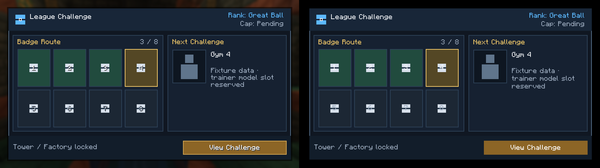
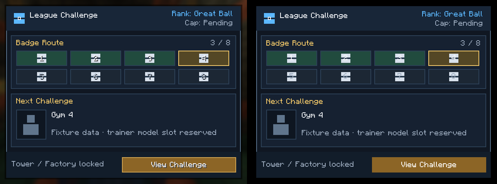

# League 홈 UI 백엔드 스파이크 결과

- 상태: `non-normative evidence record`
- 실행일: 2026-09-25
- 대상: GUI 백엔드를 결정할 빡대리님과 후속 구현자
- fixture: `badges_3`
- 런타임: Minecraft 1.21.1, Fabric Loader 0.19.5, owo-lib 0.12.15.4+1.21

이 문서는 코드 드로잉과 owo 후보를 같은 fixture로 실제 Minecraft 클라이언트에서 실행한 결과를 기록한다. 백엔드 최종 채택 기록이 아니며, [GUI_FRAMEWORK_AND_RESOURCE_PACK.md](GUI_FRAMEWORK_AND_RESOURCE_PACK.md)의 LGUI-2 승인 조건을 대체하지 않는다.

## 캡처

### 논리 해상도 427×240

[코드 드로잉 원본](assets/ui-spike/league-code-badges_3-427x240.png) · [owo 원본](assets/ui-spike/league-owo-badges_3-427x240.png)



### 논리 해상도 320×240

[코드 드로잉 원본](assets/ui-spike/league-code-badges_3-320x240.png) · [owo 원본](assets/ui-spike/league-owo-badges_3-320x240.png)



## 관찰한 사실

| 항목 | 코드 드로잉 | owo 후보 |
| --- | --- | --- |
| 정보 구조 | 계급, 레벨캡, 뱃지, 다음 도전, 시설 상태와 행동 버튼 표시 | 동일 |
| 320×240 배치 | 세로형으로 전환하며 캡처 범위 안에 유지 | 동일 |
| 427×240 배치 | 뱃지와 다음 도전을 좌우로 배치 | 동일 |
| 배경 | 흐려진 Minecraft 파노라마와 외곽 그림자 유지 | 불투명한 검은 루트 배경 |
| 버튼 | 1픽셀 외곽선 포함 | 현재 flat renderer에는 외곽선 없음 |
| 기본 위젯 외형 | 사용하지 않음 | 사용하지 않고 사용자 정의 surface와 renderer 적용 |

따라서 owo를 사용하면 JEI 같은 기본 위젯 외형으로 고정된다는 가설은 이 스파이크에서 반례가 나왔다. owo 컴포넌트를 사용하면서도 League 테마를 코드 드로잉과 거의 같은 형태로 표현할 수 있었다.

코드 드로잉 첫 캡처에서는 사용자 정의 내용 전체가 흐려졌다. 화면이 직접 `renderBackground`를 호출한 뒤 `Screen.render`를 다시 호출해 배경 처리가 중복된 것이 원인이었다. 버튼만 직접 렌더링하도록 고친 뒤 위 비교 캡처를 다시 만들었다.

## 현재 판단

owo는 MbcUI의 비공개 Minecraft 백엔드 선두 후보로 유지한다(SHOULD). 이 판단은 두 해상도에서 시각 구조를 재현했다는 근거에만 한정한다. 다음 항목을 실제 게임에서 검증하기 전에는 최종 채택하면 안 된다(MUST NOT).

- 키보드 포커스 이동, 마우스 입력과 ESC
- 내레이션과 비활성 버튼 설명
- 3D 트레이너 슬롯과 scissor 경계
- 640×360, 한국어와 긴 문자열
- 프레임 시간과 입력 지연

## 임시 구현 경계

현재 `LeagueChallengeOwoSpikeScreen`은 비교를 위해 League 모듈에서 owo를 직접 참조한다. 이는 개발 환경 명령과 자동 캡처에만 쓰는 일회성 예외다. 제품 구조에서는 League가 owo 타입을 참조하면 안 된다(MUST NOT).

LGUI-3에 들어가기 전에 다음 중 하나를 수행해야 한다(MUST).

1. owo를 채택하면 렌더러 소유권을 MBC 안으로 옮기고 League는 백엔드 비종속 `MbcUI` 계약만 사용한다.
2. owo를 기각하면 `LeagueChallengeOwoSpikeScreen`, 관련 명령과 의존성을 제거한다.

이 예외가 남은 JAR은 제품 배포 대상으로 취급하지 않는다.

## 재현 방법

개발 클라이언트에서 수동으로 연다.

```text
/mbc-league-ui badges_3
/mbc-league-ui-owo badges_3
```

자동 캡처는 프로세스 환경 변수로 백엔드와 fixture를 고른다.

```text
MBC_LEAGUE_CAPTURE_BACKEND=code|owo
MBC_LEAGUE_CAPTURE_FIXTURE=badges_3
```

캡처 하네스는 개발 환경에서만 설치되며, 화면을 연 뒤 20틱을 기다려 `run/screenshots`에 PNG를 저장하고 클라이언트를 종료한다.
