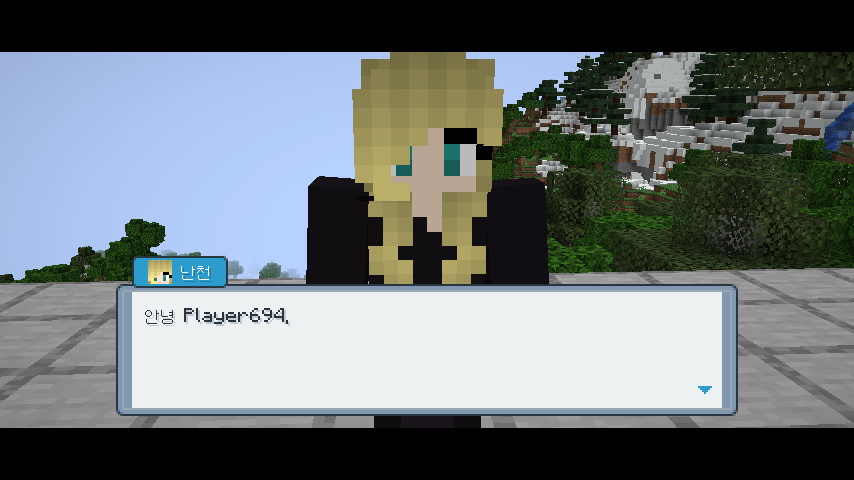
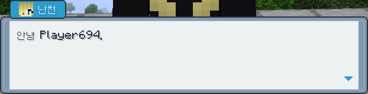

# Cobblemon NPC

Create talking NPCs with an in-game editor. Give them a name and skin, write dialogue pages, offer choices, branch on player conditions, and run commands as the conversation progresses. The server controls dialogue and editing permissions.

*Actual game capture from October 6, 2026. The pictured trainer skin comes from an external resource pack; the camera uses optional Better Cobblemon Battlecam.*

## Installation

Install the same version on **both client and server**. Requires Minecraft 1.21.1, Java 21, Fabric Loader 0.19.5+, Fabric API, Fabric Language Kotlin 1.14.1+kotlin.2.4.20+, and Cobblemon 1.8.1 (below 1.9.0). Cobblemon UI is bundled. Better Cobblemon Battlecam and Mod Menu are optional. Trainer skin packs are not included.

## Use and settings

Operators with permission level 2 use `/npc wand`. Right-click a block to place an NPC; right-click the NPC with the wand to edit its name, skin and dialogue, preview conversations, or remove it. Players right-click the NPC to talk.

Dialogue files live on the server at `config/cobblemon_npc/dialogues/<id>.json`. Use `/npc reload` after editing files. `/npc talk <players> <dialogue> [node]` opens a conversation without an NPC; `/npc end <players>` closes it. See the [operator guide](docs/OPERATOR_GUIDE.md) for JSON, conditions and command permissions.

Mod Menu opens local client settings. **Dialogue camera** defaults to On and requires Better Cobblemon Battlecam. Done saves `config/cobblemon_npc-client.json`; Cancel leaves the preference unchanged. NPC content is edited with the wand, not in this settings screen. Dialogue controls use the bundled Cobblemon UI key bindings.

## License and media

Original module code is under [MIT](LICENSE). Bundled dependencies retain their own notices; see [NOTICE](NOTICE.md). Screenshots contain external game and resource-pack artwork and are not a grant to redistribute those assets. [Media provenance](docs/MEDIA.md) · [한국어 설명](docs/DESCRIPTION_KO.md).

Build from `works`: `./gradlew :cobblemon-npc:build`.
