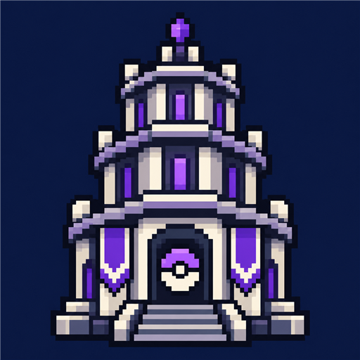

# More Cobblemon Contents: Battle Tower

자신의 포켓몬 팀으로 연승에 도전하는 MCC 애드온입니다.

## 주요 기능

- MCC 배틀 허브와 배틀타워 터미널에서 시작하는 도전
- 배틀타워 상대 대진과 연승 진행
- MCC 본체와 공유하는 전투 관리, BP 및 기록

## 설치

**클라이언트와 서버 양쪽에 설치합니다.** 싱글플레이에서도 같은 클라이언트 모드를 사용합니다.

| 항목 | 요구 사항 |
|---|---|
| Minecraft / Java | Java Edition 1.21.1 / Java 21 이상 |
| 로더 | Fabric Loader 0.19.5 이상 |
| 공통 필수 모드 | Fabric API, Fabric Language Kotlin 1.14.1+kotlin.2.4.20 이상, Cobblemon 1.8.1 이상 / 1.9.0 미만 |
| 기반 모드 | More Cobblemon Contents Core 0.1.0 이상 / 1.0.0 미만 |
| 선택 모드 | Mod Menu — 모드 목록 및 지원하는 설정 안내에 사용 |

1. 서버와 접속할 클라이언트의 `mods` 폴더에 모드 JAR과 필수 모드를 넣습니다. 필요한 지원 라이브러리는 각 의존 모드의 설치 안내를 따릅니다.
2. 본체와 사용하려는 애드온을 같은 구성으로 설치합니다. 애드온은 본체 없이 사용할 수 없습니다.
3. 플레이어는 `/mcc` 또는 콘텐츠의 홀로그램 터미널로 배틀 허브를 엽니다. 서버에서 해당 탭을 허용해야 접근할 수 있습니다.

## 설정과 콘텐츠 편집

플레이어는 허브의 배틀타워 화면에서 도전을 진행합니다. 현재 별도 Mod Menu 설정 화면은 없습니다.

상대 구성과 대진은 서버 데이터팩의 `mcc-battle-tower/` 아래 콘텐츠로 관리합니다. 클라이언트 설정으로 서버의 상대나 진행 규칙을 바꾸지 않습니다. 데이터팩 변경 후 관리자 권한으로 `/reload`를 실행합니다.

## 문제 해결

- 모드가 로드되지 않으면 클라이언트·서버의 모드 구성과 필수 의존성을 확인하세요.
- 허브에 콘텐츠가 보이지 않으면 해당 애드온 설치 여부와 본체의 `hub_tabs.json` 설정을 확인하세요.
- 데이터팩을 수정한 뒤 문제가 생기면 서버 로그에서 잘못된 콘텐츠 정의를 확인하세요. 모드 JAR을 직접 수정하는 대신 서버 데이터팩을 사용합니다.

## 라이선스와 배포 설명

이 모드의 자체 코드와 아이콘은 [MIT License](LICENSE)로 제공합니다. 의존 모드와 내장 라이브러리는 각각의 라이선스를 따릅니다.

공개 배포 페이지용 영문 설명은 [MODRINTH.md](MODRINTH.md)에 있습니다. [소스](https://github.com/taku7664/Minecraft-Cobblemon-Mods/tree/main/works/mods/more-cobblemon-contents-battle-tower) · [문제 신고](https://github.com/taku7664/Minecraft-Cobblemon-Mods/issues)
