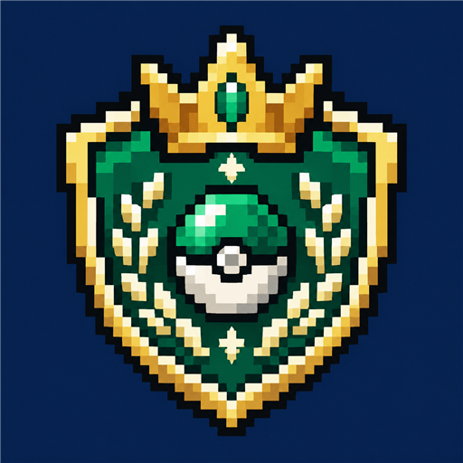

# More Cobblemon Contents: League Challenge

체육관 도전부터 배지·계급·사천왕·챔피언까지 이어지는 MCC 리그 애드온입니다.

## 주요 기능

- 별도의 리그 터미널과 GUI에서 진행하는 도전
- 체육관, 배지, 계급과 포켓몬 리그 진행
- 서버 데이터팩으로 정의하는 상대 팀과 보상
- PokeBadges 및 Cobbled Level Control을 통한 배지·레벨캡 연동

물리적인 체육관 건물을 추가하는 방식이 아니라, 독립 터미널과 도전 화면으로 리그를 진행합니다.

## 설치

**클라이언트와 서버 양쪽에 설치합니다.** 싱글플레이에서도 같은 클라이언트 모드를 사용합니다.

| 항목 | 요구 사항 |
|---|---|
| Minecraft / Java | Java Edition 1.21.1 / Java 21 이상 |
| 로더 | Fabric Loader 0.19.5 이상 |
| 공통 필수 모드 | Fabric API, Fabric Language Kotlin 1.14.1+kotlin.2.4.20 이상, Cobblemon 1.8.1 이상 / 1.9.0 미만 |
| 기반 모드 | More Cobblemon Contents Core 0.1.0 이상 / 1.0.0 미만 |
| 추가 필수 모드 | PokeBadges, Cobbled Level Control 1.2.x |
| 선택 모드 | Mod Menu — 모드 목록 및 지원하는 설정 안내에 사용 |

1. 서버와 접속할 클라이언트의 `mods` 폴더에 모드 JAR과 필수 모드를 넣습니다. 필요한 지원 라이브러리는 각 의존 모드의 설치 안내를 따릅니다.
2. 본체와 사용하려는 애드온을 같은 구성으로 설치합니다. 애드온은 본체 없이 사용할 수 없습니다.
3. 플레이어는 `/mcc` 또는 콘텐츠의 홀로그램 터미널로 배틀 허브를 엽니다. 서버에서 해당 탭을 허용해야 접근할 수 있습니다.

## 설정과 콘텐츠 편집

**Mod Menu에 기존 설정 안내 화면이 있습니다.** 이 화면은 서버 규칙 편집기가 아니라 설정 위치를 설명하는 화면입니다.

- 서버 데이터팩의 `league-challenge/`에서 리그·상대 팀·보상 등 콘텐츠를 관리합니다.
- 레벨캡은 Cobbled Level Control의 숫자 단계와 리그 정의를 맞춰 관리합니다.
- 외형의 스킨 텍스처는 클라이언트 리소스팩에서 제공합니다.

데이터팩 변경 후 관리자 권한으로 `/reload`를 실행합니다. 클라이언트에서 서버 레벨캡을 변경할 수 없으며, 진행 중인 연전의 팀을 즉시 교체하는 방식으로 사용하지 않습니다.

### 야생 포켓몬 레벨

64×64블록 구역마다 플레이어와 무관한 기준값 10~83이 정해집니다. 시작 구역은 10이고, 이동하면 기준값이 서서히 달라집니다. 2,048×2,048블록 권역마다 최고 기준값 83인 지역이 하나 이상 있습니다.

새 스폰은 `min(지역 기준값, 스폰을 일으킨 플레이어의 레벨캡)`에서 9~3 낮은 범위를 균등 추첨합니다. 시작 지역의 실제 포켓몬은 1~7레벨이며, 최고 지역은 캡이 충분하면 74~80입니다. 기존 포켓몬의 레벨은 바뀌지 않습니다.

서버 데이터팩 `league-challenge/leagues/active.json`의 `wild_level`에서 조정합니다. 기본값은 `below_cap: 6`, `spread: 3`, `region_chunks: 4`, `region_min: 10`, `region_max: 83`, `transition_regions: 16`입니다. 이전 `floor_level` 필드는 제거해야 합니다. 자세한 계약과 설정은 [야생 레벨 V2](docs/WILD_SPAWN_LEVELS_V2.md)를 참고하세요.

## 문제 해결

- 모드가 로드되지 않으면 클라이언트·서버의 모드 구성과 필수 의존성을 확인하세요.
- 허브에 콘텐츠가 보이지 않으면 해당 애드온 설치 여부와 본체의 `hub_tabs.json` 설정을 확인하세요.
- 데이터팩을 수정한 뒤 문제가 생기면 서버 로그에서 잘못된 콘텐츠 정의를 확인하세요. 모드 JAR을 직접 수정하는 대신 서버 데이터팩을 사용합니다.

## 라이선스와 배포 설명

이 모드의 자체 코드와 아이콘은 [MIT License](LICENSE)로 제공합니다. 의존 모드와 내장 라이브러리는 각각의 라이선스를 따릅니다.

공개 배포 페이지용 영문 설명은 [MODRINTH.md](MODRINTH.md)에 있습니다. [소스](https://github.com/taku7664/Minecraft-Cobblemon-Mods/tree/main/works/mods/more-cobblemon-contents-league-challenge) · [문제 신고](https://github.com/taku7664/Minecraft-Cobblemon-Mods/issues)
