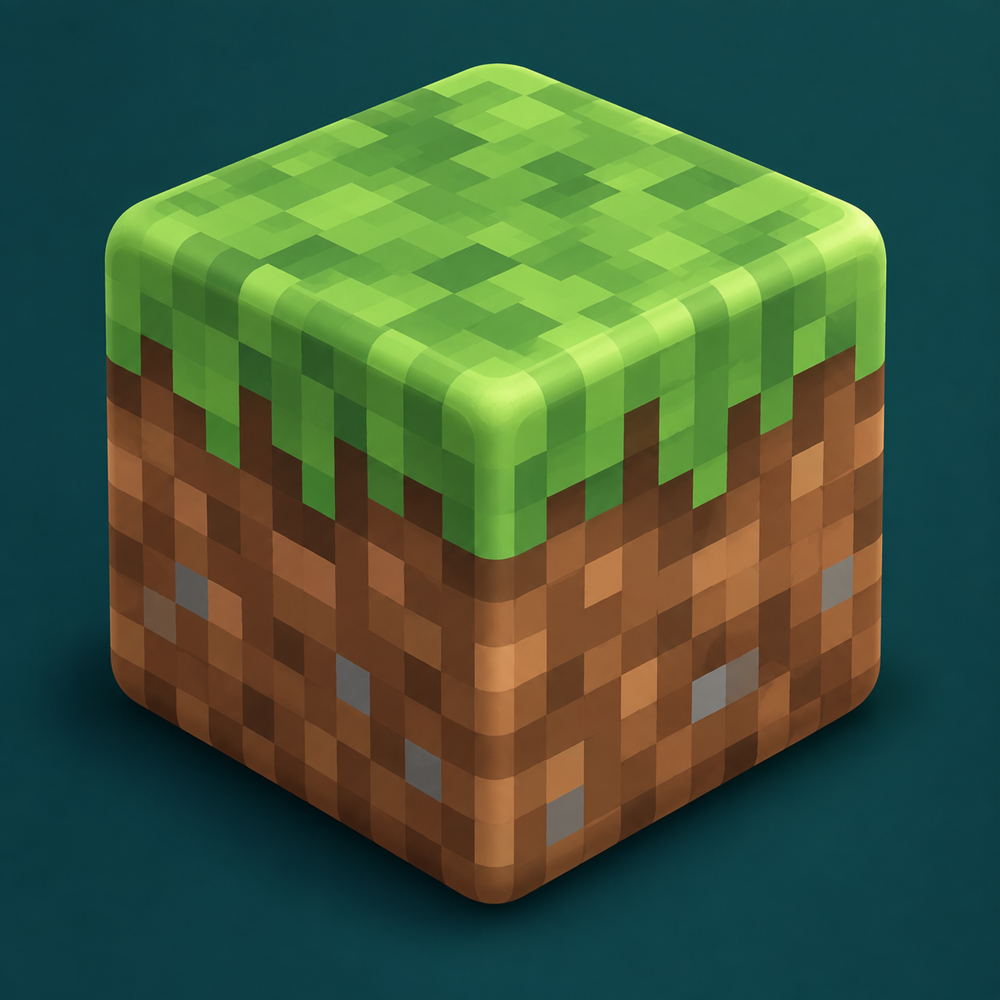

# Rounding-Block



Minecraft의 블록·반블록·계단에서 드러난 모서리를 둥글게 그리는 Fabric 클라이언트 모드입니다. 블록이 연결된 곳은 이웃 형상에 맞춰 처리하고, 물과 둥근 블록 사이에 생기는 빈 공간에는 수면을 이어 그립니다.

블록 격자, 충돌 판정, 월드 저장 데이터는 바꾸지 않습니다. 서버 설치나 Cobblemon은 필요하지 않습니다.

## 설치

- Minecraft **1.21.1**, Fabric Loader **0.19.3 이상**, Java **21 이상**
- 필수 모드: **Fabric API**
- `rounding-block-<버전>.jar`를 클라이언트의 `mods` 폴더에 넣습니다.
- 설정 모드는 필요하지 않습니다. Mod Menu가 이미 있다면 모드 목록에서도 설정 화면을 열 수 있습니다.

## 기능과 범위

- 전체 큐브, 표준 반블록, 계단의 바깥 모서리와 안쪽 접점을 라운딩합니다.
- 원래 모델의 텍스처 방향, 색상 레이어와 무작위 모델 선택을 가능한 범위에서 유지합니다.
- 넓은 물 표면은 기존 렌더러에 맡기고, 실제 라운딩된 블록과 닿는 물에만 접촉면을 추가합니다.
- 해석할 수 없는 모델은 원래 모델로 그립니다. 모든 모드 블록이나 리소스팩에 같은 결과를 보장하지 않습니다.
- Fabric Rendering API를 사용합니다. Sodium/Iris 조합별 화면과 성능은 실제 게임에서 별도로 확인해야 합니다.

아이콘은 모드를 소개하기 위한 그림이며 게임 화면 캡처가 아닙니다.

## 설정

월드에서 `/roundingblock config`를 입력하면 Minecraft 기본 설정 화면이 열립니다. **외형 / 캐시 / 진단** 탭에서 편집한 뒤 **저장 및 적용**을 누릅니다. 설정 저장 후 리소스를 다시 불러오므로 잠시 기다려 주세요. **전체 초기화**는 모든 탭의 값을 기본값으로 바꾸며, 저장 전에는 파일에 반영하지 않습니다.

첫 실행 시 `config/rounding-block.json`이 생성됩니다. 직접 편집한 값은 `/roundingblock reload`로 적용하고, 현재 적용값은 `/roundingblock show`로 확인합니다.

| 항목 | 기본값 | 허용 범위 / 의미 |
| --- | --- | --- |
| `enabled` | `true` | 둥근 블록과 물 접촉면 렌더링 사용 여부 |
| `quality.radius` | `0.09375` | `0.015625`–`0.21875` 블록. 모서리를 둥글게 만드는 폭 |
| `quality.segments` | `3` | `1`–`8`. 곡면 분할 수 |
| `cache.fullBlockPlans` | `256` | `16`–`4096`. 전체 블록 메시 캐시 항목 수 |
| `cache.slabPlans` | `256` | `16`–`4096`. 반블록 메시 캐시 항목 수 |
| `cache.complexShapePlans` | `256` | `16`–`4096`. 계단 등 복합 형상 메시 캐시 항목 수 |
| `cache.fluidContactPlans` | `256` | `16`–`4096`. 물 접촉면 캐시 항목 수 |
| `cache.weightedModelVariants` | `32` | `1`–`256`. 무작위 모델 외형 분석 캐시 항목 수 |
| `debug.diagnosticLogging` | `true` | 렌더 경로 진단 로그 출력 여부 |

분할 수를 올리면 곡면이 부드러워지는 대신 그려야 할 면이 늘어납니다. 캐시 크기는 저장하는 계산 결과의 개수이며 FPS 목표나 메모리 용량(MB)이 아닙니다.

JSON에서 잘못된 값은 항목별 기본값을 사용합니다. JSON 문법이 깨진 파일은 자동으로 덮어쓰지 않습니다. 화면에서는 잘못된 숫자를 저장할 수 없고, 적용 실패 시 이전 활성 설정과 저장값을 복원합니다. 파일 저장이나 복원 오류의 상세 내용은 로그에서 확인합니다.

명령으로도 개별 값을 저장하고 적용할 수 있습니다. 모든 명령은 클라이언트에서 실행되며 서버 권한이 필요하지 않습니다.

```text
/roundingblock enabled <true|false>
/roundingblock quality radius <값>
/roundingblock quality segments <값>
/roundingblock cache fullBlockPlans <값>
/roundingblock cache slabPlans <값>
/roundingblock cache complexShapePlans <값>
/roundingblock cache fluidContactPlans <값>
/roundingblock cache weightedModelVariants <값>
/roundingblock debug diagnosticLogging <true|false>
```

## 배포 설명과 라이선스

영문·국문 소개 문구는 [MODRINTH.md](MODRINTH.md)에 있습니다. 모듈에는 저장소와 같은 [MIT 라이선스](LICENSE)를 적용하며, 일반 JAR와 소스 JAR에 `LICENSE_rounding-block`을 포함합니다. 검토 범위와 아이콘 생성 기록은 [RELEASE_REVIEW.md](RELEASE_REVIEW.md)에 정리했습니다.

## 개발

저장소의 `works/`에서 실행합니다.

```powershell
.\gradlew.bat :rounding-block:build --no-daemon
```

빌드의 `check`가 `unitTest`를 실행합니다. 결과는 `works/mods/rounding-block/build/libs/`에 생성됩니다. 자동 테스트와 빌드 통과는 게임 내 외형·설정 화면·FPS 검증과 별개입니다.
